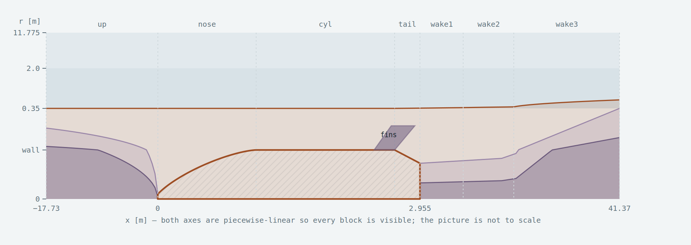
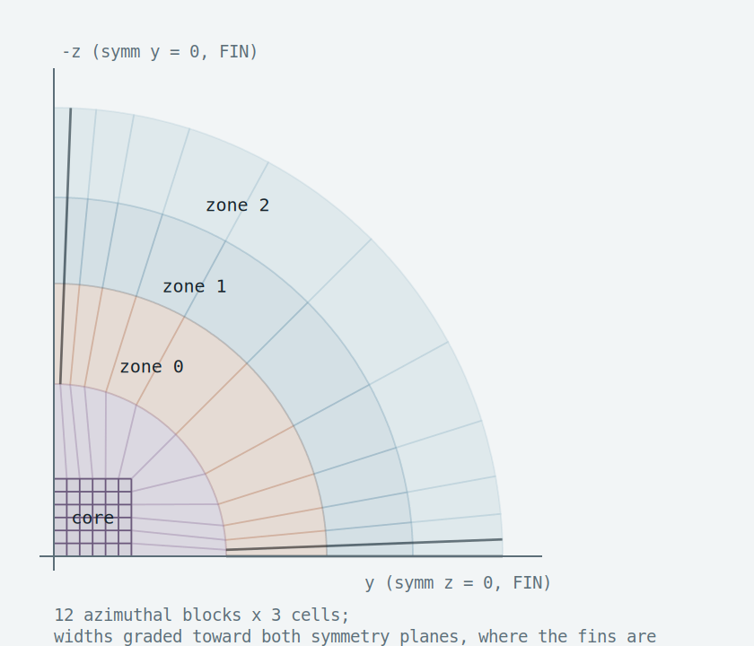
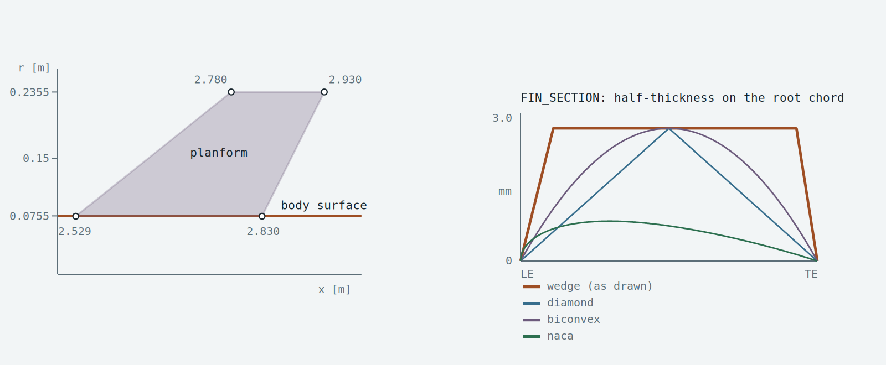

# Aconcagua — gmsh structured mesh

3,538,188 cells, 100 % hexahedra, fins resolved, amplified wake.
Non-orthogonality mean **1.49 deg**, max 75.9, 6,999 faces above 70.

---

## 1. Mesh zones

**Streamwise segments and radial levels.** Both axes are piecewise-linear so every
block is visible — the picture is not to scale.



The copper line is **shell 1**, the fine radial band. Downstream of the base it
**opens out from 0.35 m to 0.70 m** so it tracks the spreading wake instead of the
wake growing out of it. Plum is the butterfly core and ring, which exist only where
the axis is fluid — upstream of the nose cap and downstream of the base.

**Cross-plane tiling** of the quarter: 12 azimuthal blocks × 3 cells, block widths
graded toward both symmetry planes because that is where the fins are. The butterfly
core is a 6 × 6 grid of sub-blocks: a single quad core can present only two edges to
the ring, so `N_AZ_BLOCKS > 2` requires an (N/2) × (N/2) core.



| Level | Zone | Extent | Cells | Present where |
|---|---|---|---|---|
| L0 | core | butterfly square, half-width 0.45·R_i | 18 × 18 | axis fluid only |
| L1 | ring | square → inner circle R_i(x) | 10 radial | axis fluid only |
| L2 | zone 0 | wall → `ZONE_R[0]` = 0.35 m (0.70 m at the outlet) | 57 radial | everywhere |
| L3 | zone 1 | → `ZONE_R[1]` = 2.00 m | 21 radial | everywhere |
| L4 | zone 2 | → `ZONE_R[2]` = 11.775 m — **this is the farfield** | 14 radial | everywhere |

| Segment | x₀ | x₁ | Axial cells | Wall patch |
|---|---|---|---|---|
| up (×6) | −17.730 | 0.026 | 79 | — |
| nose (×14) | 0.026 | 0.800 | 153 | cone |
| cyl | 0.800 | 2.469 | 209 | walls |
| cylfin | 2.469 | 2.830 | 72 | walls |
| tail | 2.830 | 2.955 | 25 | tail |
| wake1 | 2.955 | 3.255 | 110 | — |
| wake2 | 3.255 | 6.955 | 222 | — |
| wake3 | 6.955 | 41.370 | 91 | — |

**Fins.** Planform and section:



---

## 2. Parameters — `meshParams.py`

You give **cell sizes**; counts are derived from `c = (L−h₁)/(L−h_N)` and
`n = 1 + ln(h_N/h₁)/ln c`. Both closed form.

### Global coarsity — one number

```python
H_SCALE      = 1.0     # multiplies every cell size, divides every cell count
H_SCALE_WALL = True    # False holds y1 (and y+) fixed while the rest scales
```

Everything re-solves from the scaled sizes, so distributions stay correct rather
than being thinned out. `AG_COARSE=<n>` overrides it from the shell for a quick look.

| `H_SCALE` | cells | non-orth mean | max skew | build |
|---|---|---|---|---|
| 0.8 | 7,430,784 | — | — | |
| **1.0** | **3,538,188** | **1.49°** | 3.16 | ~2 min |
| 2.0 | 590,304 | 1.71° | 2.72 | ~25 s |
| 3.0 | 124,716 | 2.02° | — | ~10 s |
| 4.0 | 70,596 | 2.26° | — | |
| 6.0 | 30,768 | 2.73° | — | ~5 s |

Set `H_SCALE_WALL = False` for a grid-convergence study: y⁺ stays at 32 while every
other direction coarsens.

### Refinement zones — the block to edit

```python
ZONE_R = [0.35, 2.00, 11.775]    # where each zone ENDS; LAST ONE IS THE FARFIELD
ZONE_H = [0.020, 0.200, 1.600]   # cell size at the OUTER edge of each zone
WAKE_ZONE_K   = 0                # which zone opens into the wake
ZONE0_R_WAKE  = 0.70             # that zone's outer radius at the outlet
WAKE_SPREAD_P = 0.5              # turbulent wake spreads as x^(1/2)
F_INLET    = 0.63                # blend tube at the inlet, as a FRACTION of zone 0
F_WAKE_OUT = 0.50                # blend tube at the outlet, same
```

`R_FAR` and `SHELLS` are **derived** from `ZONE_R`/`ZONE_H` — the farfield radius is
stated once, as `ZONE_R[-1]`. The blend tubes are fractions rather than metres so they
cannot outgrow the zone that contains them.

`validate_params()` runs on every build and names what is wrong:

| Rule | Error if broken |
|---|---|
| `ZONE_R` strictly increasing | `ZONE_R must increase: [...]` |
| `ZONE_R[0] > R_BODY` | `ZONE_R[0] = ... is inside the body` |
| `ZONE_R[k] ≤ ZONE0_R_WAKE < ZONE_R[k+1]`, k = `WAKE_ZONE_K` | that zone would close up, or swallow the next |
| `FIN_X_LEAD` keeps the fin block start on the cylinder | names the resulting x and the valid range |
| `H_SCALE > 0` | out of range |
| `ZONE_H[k]` smaller than zone k | `ZONE_H[k] is not smaller than zone k, which is ... wide` |
| `0 < F_INLET, F_WAKE_OUT < 1` | out of range |
| `CORE_FRAC < 1/√2` | the core square would poke through its own ring |
| `N_AZ_BLOCKS` even and ≥ 2 | the core grid is undefined otherwise |

### Everything else

| Parameter | Value | What it does |
|---|---|---|
| `N_AZ_BLOCKS` | 12 | azimuthal blocks per quadrant, **must be even** (the core is an (N/2)² grid) |
| `N_AZ_CELLS` | 3 | cells per azimuthal block → 36 per quadrant, 144 around |
| `AZ_BLOCK_GROWTH` | 1.50 | block-width ratio, from the symmetry planes inward |
| `AZ_FIN_H` | 5e-4 m | first azimuthal cell at r = R_BODY in the block touching each symmetry plane. `None` = uniform |
| `N_RING` | 10 | cells across the butterfly ring |
| `YPLUS_TARGET` | 32 | y⁺ at the first cell **centre**; y₁ = 303 µm, 31 cells inside δ |
| `SEGMENTS` | `h_start, h_end` | streamwise cell size. `None` = continue from the neighbour |
| `F_UP_INLET` | 0.50 | inlet streamwise cell, as a fraction of the first upstream sub-block (capped by `F_UP_MAX`) |
| `H_WAKE_BASE` | 5e-4 m | first cell off the flat base — it is a wall |
| `CAP_R_FRAC` | 0.10 | butterfly cap rim / R_BODY. Rim 7.55 mm at x = 26.3 mm |
| `CORE_FRAC` | 0.45 | core half-width / R_i. Must stay < 0.707 (validated) |
| `X_WAKE_1` / `X_WAKE_2` | 0.30 / 4.00 m | near wake runs to 27 body diameters |
| `WAKE_ZONE_K` | 0 | which zone opens into the wake |
| `FIN_H_X` / `FIN_X_LEAD` | 0.005 / 0.060 m | streamwise refinement over the fin chord |
| `H_SCALE` / `H_SCALE_WALL` | 1.0 / `True` | global coarsity |
| `UPSTREAM_L` / `DOWNSTREAM_L` | 6 / 13 | domain, in body lengths |
| `FINS_ON` | `True` | |
| `FIN_SECTION` | `'wedge'` | `wedge` / `diamond` / `biconvex` / `naca` / `naca_te` |
| `FIN_TIP_SMEAR` | 0.004 m | radial band closing the tip taper |

Geometry constants live in `aconcaguaGeom.py`: five numbers define the body
(`L_NOSE`, `L_CYL`, `L_TAIL`, `R_BODY`, `R_BASE`), everything else derived, and
`validate()` asserts the invariants.

## 3. Scripts

```
python3 meshParams.py          # print the plan before building anything
python3 meshFinish.py          # build -> snap -> fins -> audit -> write .msh   (~100 s)
AG_COARSE=4 python3 meshFinish.py   # quarter resolution smoke test, ~3 s
./Allmesh                      # gmshToFoam -> patch types -> checkMesh -> renumberMesh
```

| File | What it is |
|---|---|
| `aconcaguaGeom.py` | geometry of record, replaces the STL. Self-verifying. |
| `meshParams.py` | the only file you normally edit |
| `blockTools.py` | memoising structured-block layer over gmsh |
| `buildHexBody.py` | the block topology |
| `finPatch.py` | fin deformation + patch split |
| `meshQuality.py` | OpenFOAM's quality measures, validated |
| `meshFinish.py` | driver |
| `fixPatchTypes.py` | **run right after gmshToFoam, not optional** |

Setup:

```
pip install gmsh --break-system-packages
sudo apt install libglu1-mesa     # import gmsh fails with OSError: libGLU.so.1 without it
```

The `.msh` is 460 MB ASCII — **generate it locally, do not copy it**.

`gmshToFoam` makes every patch `type patch`. `symm` fails loudly; **`cone`/`walls`/
`tail`/`fins` fail silently** — wall functions, yPlus and forceCoeffs all quietly
wrong. `fixPatchTypes.py` sets them and errors on anything unrecognised.

Patches: `inlet` `outlet` `symm` `box` `cone` `walls` `tail` `fins` — 234,736 faces,
exactly the boundary-face count, so nothing lands in `defaultFaces`.

---

## 4. Additional modifications

### How the fins went in

No blocks were added. The azimuthal coordinate is **deformed**:

```
theta -> theta_f(x,r) + theta * (90 - 2 theta_f) / 90     theta_f = arcsin(t_half / r)
```

A node that was on the symmetry plane lands at `z = -t_half`, which **is** the fin
surface, exact to **0.0 nm**; wetted area 718.62 cm² against 723.00 cm² analytic.

It works only because the real fin is bevelled — thickness goes to zero continuously
at the leading and trailing edges, so the deformation relaxes to nothing there. Both
symmetry planes get it: the quarter contains two half fins, one lying in each.
`theta_f` is 2.28° at the root, 0.73° at the tip.

### Refining around the fins

Three directions, three places to edit.

| Direction | Parameter | Now | Effect |
|---|---|---|---|
| **azimuthal** | `AZ_FIN_H` | 5e-4 m | first cell off the fin surface → y⁺ ≈ 53 |
| | `AZ_BLOCK_GROWTH` | 1.50 | how fast blocks widen away from the fin |
| **streamwise** | `FIN_H_X` | 0.005 m | cell over the fin chord; splits `cyl` into `cyl` + `cylfin` and refines `tail`. `None` = off |
| | `FIN_X_LEAD` | 0.060 m | cylinder included ahead of the root leading edge |
| **radial** | `ZONE_R` / `ZONE_H` | see below | add a zone just outside the tip |

What those settings currently produce:

| | value |
|---|---|
| first cell off the fin, azimuthal | 0.500 mm |
| streamwise over the chord, `cylfin` x 2.4692 … 2.8300 | 5.000 mm, 72 cells |
| streamwise over the boattail, `tail` | 5.000 mm, 25 cells |
| radial at the fin tip, r − R = 0.16 m | 11.89 mm |
| fin faces | 5,218 |

**Radial refinement at the tip** is the one that needs a zone rather than a knob. The
tip sits at r = 0.2355 m, inside zone 0, where the radial stack has already grown to
~12 mm. Add a zone boundary outside it and give it a small size:

```python
ZONE_R = [0.28, 0.35, 2.00, 11.775]
ZONE_H = [0.006, 0.020, 0.200, 1.600]
WAKE_ZONE_K = 1          # zone 1 now carries the wake opening, not zone 0
```

That gives 106 cells from the wall to 0.28 m at ratio 1.029, 6 mm at the tip instead
of 12, and 147 radial cells in total against 92. `WAKE_ZONE_K` must move with it —
`ZONE0_R_WAKE` opens whichever zone it indexes, and leaving it at 0 raises:

```
ZONE0_R_WAKE 0.7 >= ZONE_R[1] 0.35: zone 0 would swallow zone 1 at the outlet.
Either lower ZONE0_R_WAKE or set WAKE_ZONE_K to the outermost fine zone.
```

### Azimuthal quality

| non-orth mean | **1.49°** |
|---|---|
| non-orth max | 75.85° |
| faces > 70° | 6,999 of 10,481,442 |
| max skewness | 3.16 |
| mean skewness | 0.012 |

Two things produce this, and both are needed.

**Radial curves are canonicalised inward → outward before creation.** A radial curve is
edge 0 of one annulus block and edge 2 of its neighbour, so the two blocks request it in
opposite directions, and whichever call reaches the memo first fixes the direction gmsh
runs the progression in. Without canonicalisation one azimuthal column gets the intended
wall-clustered stack and every other column gets its reciprocal — first radial cell
11.5 mm against 30.5 mm at the same station, cells shrinking outward instead of growing.
The same rule already applies to the azimuthal families in `_az`.

**Small angular spans.** A transfinite quad blends radius linearly in index, so the
interpolation error scales with the block's arc-to-chord sagitta. The widest sector is
now 16.4° (sagitta 0.0103) against 45° (0.0761).

### Still open

6,999 faces above 70°, out of 10.5 million. Aspect ratio reaches 63.2 in the fine
azimuthal cells at the symmetry planes. Neither is blocking; `fvSchemes` carries
`limited corrected 0.33` and `nNonOrthogonalCorrectors 1`.

### Toolchain constraints the code depends on

Each of these forces something in `blockTools.py` or `buildHexBody.py`. Changing that
code without honouring them produces a mesh that builds and is wrong.

| Constraint | What it forces |
|---|---|
| a memoised shared entity is created once, in whichever direction the first caller asks | canonicalise direction before creating any curve — radial, azimuthal, axial |
| gmsh spaces transfinite points on a spline by **arc length, not parameter** | control points cannot dictate node positions; sample densely for curve accuracy and pass the real progression |
| a power blend `ξ^q` with 1 < q < 2 has **unbounded curvature** at ξ = 0 | the upstream blend is tangent-matched, `Rᵢ² = r_cap² + 2 r_cap s_cap t + λt²` |
| a transfinite quad drifts off a **curved** meridian by (linear blend of end radii − true radius) × (arc − chord) | the nose is 14 blocks with stations equidistributing \|r″\|^½; error falls as 1/n² |
| every gmsh model Point carries a mesh node | spline control points are un-meshed by `drop_control_nodes()` |
| a gmsh physical group is **per-surface**, but one block face carries both fin and symm | the fin patch is split at element level in the `.msh` |
| `c ** n` overflows once n·ln c passes ~709 | `stack_sum` is log-guarded |
| `gmshToFoam` types **every** patch `patch` | `fixPatchTypes.py` must list every patch and skip the `FoamFile` header |

`Aref` in `controlDict` references **the body cross-section**, not the fin semi-span:
`Aref = 0.0044770 m²`, `lRef = 0.1510 m`. `fins` is in the `forceCoeffs` patch list, and
that list must match the mesh — `forceCoeffs` aborts on a patch name it cannot find.

## Current quality

| | snappyHexMesh | this mesh |
|---|---|---|
| cells | 2,475,822 | 3,538,188 |
| hexahedra | 96.9 % | **100 %** |
| polyhedra / prisms | 67,047 / 10,045 | **0 / 0** |
| concave cells | 6,026 | **0** |
| illegal faces | 11 | **0** |
| cells with volume ≤ 0 | — | **0** |
| cells inside δ | 12–20 | **31** |
| wall residual | — | **0.00 nm** |
| max skewness | 2.51 | 3.16 |
| max aspect ratio | 24.7 | 63.2 |
| non-orth mean | 6.81° | **1.49°** |
| non-orth > 70° | 496 | 6,999 |
| y⁺ on the fins | — | ~53 |
